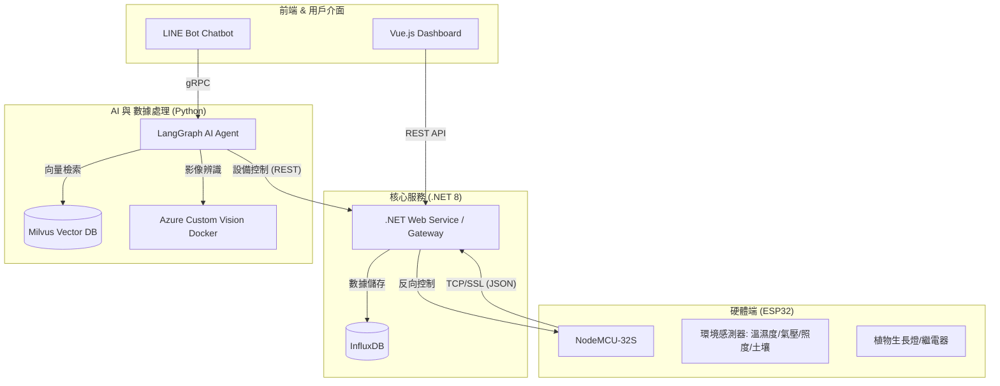

# KSU-Project: 智慧農業與環境監測系統 (Smart Agriculture & Environment Monitoring System)

這是一個整合物聯網 (IoT)、人工智慧 (AI) 與 Web 監控技術的綜合性專案。旨在提供完整的環境數據監測、自動化設備控制以及 AI 助手的智慧化分析（如病蟲害診斷與草莓種植知識庫）。

## 系統架構圖



---

## 各模組說明

### 1. 核心網關與後端 (`/dotnet/Pi.WebService`)
- **技術棧:** .NET 8, ASP.NET Core
- **功能:**
  - **TCP Gateway:** 提供帶有 SSL 加密的 TCP 服務，接收來自 NodeMCU 的即時數據。
  - **數據快取與上傳:** 將即時數據快取，並依照設定的時間規則批次上傳至 InfluxDB。
  - **RESTful API:** 提供給 Vue 前端與 Python AI 服務使用的 API，包含歷史數據查詢、最新狀態獲取及 GPIO 控制。

### 2. 智慧 AI 助手 (`/python/gemini`)
- **技術棧:** Python, LangGraph, Google Gemini, gRPC, Milvus
- **功能:**
  - **LangGraph Agent:** 使用 LangGraph 建構具備邏輯判斷能力的 AI Agent。
  - **智慧植保顧問:** 透過 Milvus 向量資料庫檢索草莓種植相關知識。
  - **病蟲害診斷:** 整合 Azure Custom Vision (Docker) 的影像辨識模型，分析上傳的植物圖片是否患病。
  - **自然語言控制:** 使用者可以透過聊天介面要求 Agent 控制硬體設備（如：開啟植物燈）。

### 3. 監控儀表板 (`/vue`)
- **技術棧:** Vue 3, Vite, Vuetify, ECharts
- **功能:**
  - **即時數值看板:** 顯示當前溫度、濕度、氣壓、照度與土壤濕度。
  - **趨勢分析圖表:** 使用 ECharts 展示過去 72 小時的環境變化趨勢。
  - **硬體控制項:** 手動切換植物燈等 GPIO 設備狀態。
  - **影像監控:** 整合 WebCam 即時影像串流。

### 4. 硬體端程式 (`/node_mcu_32s`)
- **技術棧:** Arduino / ESP32
- **功能:**
  - 採集多感測器數據。
  - 透過 SSL 與後端 Gateway 建立長連接，實現雙向通訊。

### 5. 影像辨識服務 (`/azure`)
- **技術棧:** Docker, TensorFlow Lite, Flask
- **功能:**
  - 封裝由 Custom Vision 導出的模型，提供影像分類 API。

---

## 快速開始

### 環境需求
- .NET 8 SDK
- Node.js 20+
- Python 3.10+
- Docker (運行影像辨識服務)
- InfluxDB 2.x

### 安裝步驟

1. **啟動影像辨識服務:**
   ```bash
   cd azure
   docker build -t disease_check .
   docker run -p 5001:80 disease_check
   ```

2. **設定並執行 Python AI 服務:**
   - 參考 `python/gemini/README.md` 設定 `.env` 檔案。
   ```bash
   cd python/gemini
   pip install -r requirements.txt
   python server.py
   ```

3. **啟動 .NET 後端:**
   - 配置 `appsettings.json` 中的 InfluxDB 連線資訊。
   ```bash
   cd dotnet/Pi.WebService
   dotnet run
   ```

4. **啟動前端 Dashboard:**
   ```bash
   cd vue
   npm install
   npm run dev
   ```
